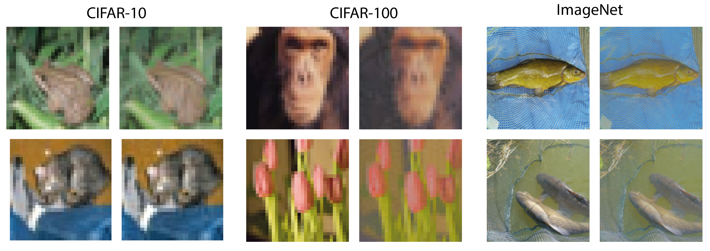

# MUFIA - Multiplicative Filter Attack
This is the official repositiory of the paper "**Frequency-Based Vulnerability Analysis of Deep Learning Models against Image Corruptions**" ([arxiv](https://arxiv.org/abs/2306.07178)).
Deep learning models often face challenges when handling real-world image corruptions. In response, researchers have developed image corruption datasets to evaluate the performance of deep neural networks in handling such corruptions. However, these datasets have a significant limitation: they do not account for all corruptions encountered in real-life scenarios. To address this gap, we present MUFIA (Multiplicative Filter Attack), an algorithm designed to identify the specific types of corruptions that can cause models to fail. Our algorithm identifies the combination of image frequency components that render a model susceptible to misclassification while preserving the semantic similarity to the original image. We find that even state-of-the-art models trained to be robust against known common corruptions struggle against the low visibility-based corruptions crafted by MUFIA. This highlights the need for more comprehensive approaches to enhance model robustness against a wider range of real-world image corruptions. 

<p align="center">
    
</p>


## Dependencies
This code has been tested with `Python 3.8.10` and `PyTorch 2.0.0+cu117`. To install required dependencies run:

```sh
cd misc
pip install -r requirements.txt
```

## Getting started
 - We set the directories for the datasets, models and configs for [wandb](https://wandb.ai/site) in [`configs/defaults.py`](config.py). Please change the directories accordingly.

- We provide a script [`scripts/test.py`](scripts/test.py) with command line arguments to test a variety of models and datasets mentioned in our paper. To simplify the process we also provide a bash script : 
    ```sh
    cd scripts
    bash run.sh
    ```


### Results

Upon running the script, the results will be logged to [wandb](https://wandb.ai/site). The results for the models mentioned in the paper are as follows:

| Dataset  	| Model    	| Architecture     	| Clean     	| CC        	| MUFIA     	| LPIPS  	|
|----------	|----------	|------------------	|-----------	|-----------	|-----------	|--------	|
| CIFAR10  	| Standard 	| ResNet-50        	| 95.25     	| 73.46     	| 0         	| 0.076  	|
|          	| Prime    	| ResNet-18        	| 93.06     	| 89.05     	| 2.27      	| 0.163  	|
|          	| Augmix   	| ResNeXt29\_32x4d 	| 95.83     	| 89.09     	| 0         	| 0.119  	|
|          	| Card     	| WideResNet-18-2  	| **96.56** 	| **92.78** 	| **38.71** 	| 0.181  	|
| CIFAR100 	| Standard 	| ResNet-56        	| 72.63     	| 43.93     	| 0         	| 0.09   	|
|          	| Prime    	| ResNet-18        	| 77.60     	| 68.28     	| 0.76      	| 0.132  	|
|          	| Augmix   	| ResNeXt29\_32x4d 	| 78.90     	| 65.14     	| 0.05      	| 0.1536 	|
|          	| Card     	| WideResNet-18-2  	| **79.93** 	| **71.08** 	| **13.31** 	| 0.148  	|
| ImageNet 	| Standard 	| ResNet-50        	| 76.72     	| 39.48     	| 0.712     	| 0.196  	|
|          	| Prime    	| ResNet-50        	| 75.3      	| 56.4      	| 0.45      	| 0.224  	|
|          	| Augmix   	| ResNet-50        	| 77.34     	| 49.33     	| 0.438     	| 0.243  	|
|          	| Deit-B   	| DeiT Base        	| **81.38** 	| **67.55** 	| **6.748** 	| 0.221  	|

Accuracy(%) on the clean uncorrupted dataset (Clean), common corruptions dataset (CC), and accuracy after our attack (MUFIA) for standard and robust models on different datasets. Our attack algorithm, MUFIA, exposes previously unseen corruptions that greatly impact the accuracy of almost all the models. Notably, while these models perform well on the common corruption dataset (CC accuracy column), they struggle when confronted with new corruptions introduced by MUFIA. Further, our attack achieves this while generating adversarial images that maintain a high degree of semantic similarity, as indicated by the LPIPS values.

## License
This project is licensed under the MIT License - see the LICENSE.md file for details.

## Acknowledgments
Our code repository is based on the following repositories. Credits to the respective authors for open-sourcing their code.
* [Prime](https://github.com/amodas/PRIME-augmentations)
* [RobustBench](https://robustbench.github.io/)
* [TorchJPEG](https://torchjpeg.readthedocs.io/en/latest/#)
* [TorchMetrics](https://torchmetrics.readthedocs.io/en/stable/)
* [WandB](https://wandb.ai/site)
* [Robustness](https://github.com/MadryLab/robustness)
* [Pretrained CIFAR10/100 models](https://github.com/chenyaofo/pytorch-cifar-models)

## Citing this work

```
@article{machiraju2023frequency,
  title={Frequency-Based Vulnerability Analysis of Deep Learning Models against Image Corruptions},
  author={Machiraju, Harshitha and Herzog, Michael H and Frossard, Pascal},
  journal={arXiv preprint arXiv:2306.07178},
  year={2023}
}
```